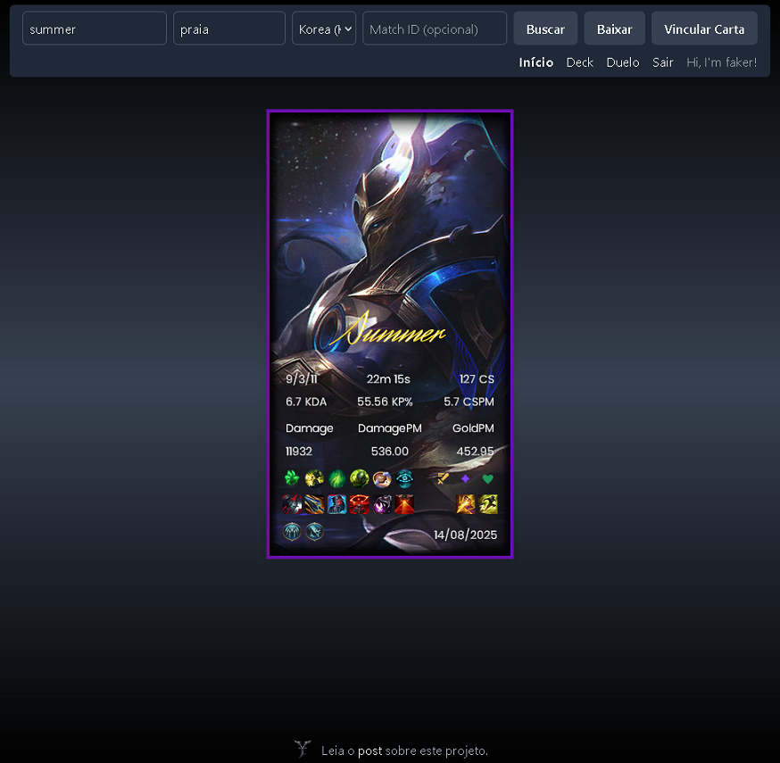
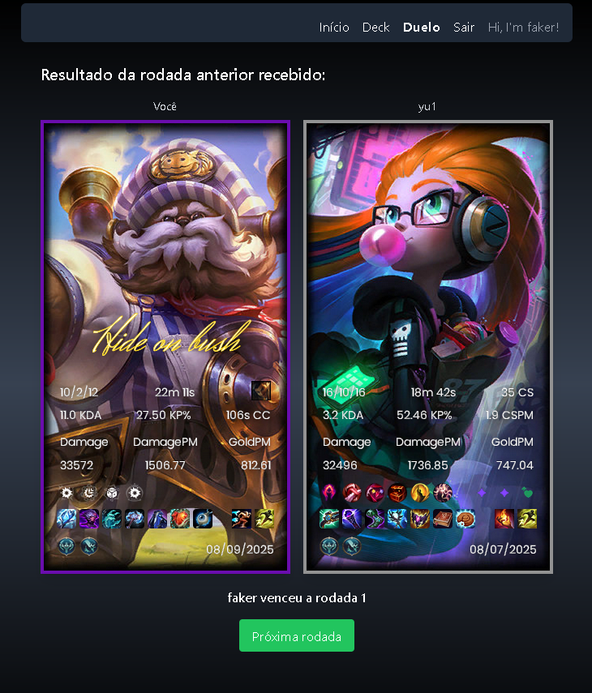

<div align="center">
   <h1>High Card Front </h1>

   
   
   
    


</div>

O **Frontend** do **High Card** é uma aplicação web que permite aos usuários salvar cartas de partidas de League of Legends, vinculá-las ou removê-las de seu deck e desafiar outros jogadores em um duelo estilo "High Card" baseado nos valores de KDA.  
Desenvolvido em **Angular v19**, **TypeScript** e estilizado com **Tailwind CSS**. O frontend é deployado na **Vercel** e consome um backend **NestJS** hospedado na **Render**, usando **MongoDB Atlas** como banco de dados.

[](https://high-card-lol.vercel.app/) 

## Tecnologias

- **Angular v19** para arquitetura baseada em componentes e reactive forms  
- **Tailwind CSS v3.4.1** para estilização  
- **RxJS** para gerenciamento de estado reativo (BehaviorSubject & Observable)
- **WebSocket** para duelos em tempo real  
- **Node.js** & **TypeScript**  
- **Vercel** para deploy do frontend  
- **Render** para deploy do backend
- **MongoDB Atlas** como banco de dados

## Funcionalidades

|                          |                                                               |
| ------------------------ | ------------------------------------------------------------- |
| ✅ Angular v19            | Versão estável utilizada no projeto                           |
| ✅ Autenticação          | Login com JWT                                                 |
| ✅ Routing & Guards      | Proteção de rotas com guards e lazy loading                   |
| ✅ Responsive Design     | Layout responsivo (desktop e mobile)                          |
| ✅ APIs                  | Integração real com a Riot Games API (requer key)             |
| ✅ Criação de Deck       | Vincular e desvincular cartas com backend integrado           |
| ✅ Duelos em tempo real  | Comunicação via WebSocket entre dois jogadores                |
| ✅ Health Check          | Verificação automática do backend na Render                   | 


## Capturas de Tela

<p align="center">
    
    
    
</p>

## Como Executar

**Importante:** Este frontend depende do **backend ativo** e de uma instância do **MongoDB** (local, Atlas ou via Docker).  
O backend também precisa estar configurado com uma **Riot API Key** para acessar os dados das partidas.
Veja no [README do backend](https://github.com/martinsevandro/high-card-back/blob/main/README.md) as instruções completas sobre como configurar a key e rodar o backend. 

### Pré-requisitos

- Node.js (versão 18 ou superior)  
- npm (versão 9 ou superior)  

> Observação: não é necessário instalar o Angular CLI globalmente. Os comandos abaixo já usam a versão definida em `devDependencies`.

### Passos

1. **Clonar o repositório**
```bash
git clone https://github.com/martinsevandro/high-card-front.git
cd high-card-front
```

2. **Instalar dependências**
```bash
npm install
```

3. **Rodar o servidor de desenvolvimento** 
```bash
npm start
```

4. **Abrir no navegador**
```bash
http://localhost:4200/
```
A aplicação recarregará automaticamente se você alterar qualquer arquivo do código-fonte.

## Sugestões e Feedback

Este projeto é principalmente um projeto de **portfólio pessoal**, portanto contribuições diretas (pull requests) **não são aceitas**.

No entanto:

**Forks** são bem-vindos: sinta-se à vontade para modificar o projeto no seu próprio fork para experimentar ou estender funcionalidades.

**Feedback e sugestões** são incentivados: se tiver ideias para melhorar a UI, UX ou recursos, abra uma issue ou entre em contato diretamente.

### Aviso sobre a Riot Games API

Este projeto utiliza dados e recursos da Riot Games API exclusivamente para fins educacionais e de estudo. Nenhum conteúdo do League of Legends é explorado comercialmente, vendido ou redistribuído.

Os usuários que desejarem testar o projeto podem gerar uma **chave temporária da Riot** para acessar os dados da API, conforme permitido pelo termo de uso da Riot.

## Licença

### Educational Use License (EUL) 1.0

Copyright (c) 2025 Francisco Evandro Ribeiro Martins Filho

O uso, cópia, modificação e distribuição deste software são permitidos somente para fins educacionais e não comerciais, conforme descrito no arquivo [LICENSE](./LICENSE).

---